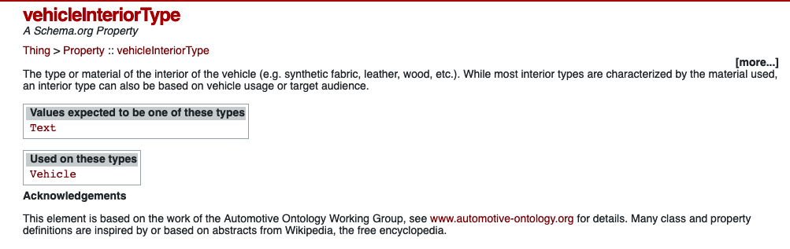
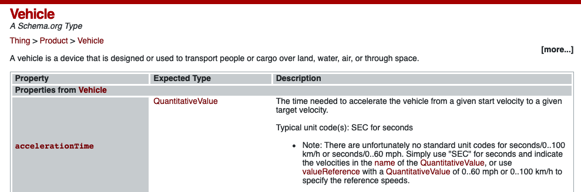

# Association Of Topics 话题的联想

充足的话题是让聊天愉快地进行下去的必要条件。

我们可能聊了一段时间后发现聊不下去了，那么如何从现有的聊天文本里找到话题呢？首先我们可以提取现有文本里的关键词，然后在语义网络上寻找相关的概念，最后通过概念的属性来产生有意义的话题。

## 第一步：提取关键词

这一步的方法很多，但是为了帮助用户更好地打开思路，我们本次主要使用先分词然后什么都不做的方法来提取关键词。

只有为用户提供海量的关键词，才能帮用户打开海量的思路。

## 第二步：联想相关概念

> 一见短袖子，立刻想到白臂膊，立刻想到全裸体，立刻想到生殖器，立刻想到性交，立刻想到杂交，立刻想到私生子。中国人的想像惟在这一层能够如此跃进。

以下面的概念网络为例，想到出行就可以想到汽车，就可以联想到日本汽车，就可以聊起汽车内饰。

```chinese
  行 → 衣／食／住
  ↓
陆上交通工具 → 水上／空中
  ↓
汽车 → 工业车／火车／电车／地铁／单车
  ↓
日本汽车 → 德国／美国／英国／法国
  ↓
丰田汽车 → 本田／日产／马自达／三菱
  ↓
哥露娜 → 皇冠／Spacio／Echo／Camry’
  ↓
汽缸容积、颜色、款型、汽车的各部分
  ↓
制造原料、成本、历史、技术需要
```

图 7-1 「上堆下切」的技巧使话题的范围更广

在 [vehicleInteriorType - A Schema.org Property](https://schema.org/vehicleInteriorType) 上可以看到，「汽车内饰」是汽车的一个属性。



在 [Vehicle - A Schema.org Type](https://schema.org/Vehicle) 上可以看到，「汽车」是一种产品，和我们上面的例子相比，少了不少概念层级，这显然会影响我们的脑洞大小，但好在这些数据是可以自由扩充的。



## 第三步：产生有意义的话题

下面可以看几个培训师最爱讲的例子：

例 1．

```chinese
可以放松和消除疲劳与家人有段快乐时光
   ↑
参加马来西亚旅游团 → 韩国、泰国、台湾
   ↓
应该有购物机会、食物合口味、风景宜人

```

例 2．

```chinese
证明我的能力/实现人生价值/每天过得开心
   ↑
找到新工作 → 创业、与人合伙、做特约顾问
   ↓
收入有多少？同事关系融洽？福利制度好吗？
```

例 3．

```chinese
你与他在一起为的是什么？
他的不好对你的人生是一份怎样的价值？
你希望他是一个怎么样的人？
   ↑
他不好 → 其他不好的人/他好的一面
   ↓
他什么不好？
在什么时间、地点、情况下他的不好出现？
他的不好之中有什么是可以接受的？
```

可以看到虽然从话题造句的模式还是比较固定的，但人类开发出的造句模式非常多。

但受制于互联数据的质量，我们只能用上其中的部分模式，其余较为复杂的模式缺乏数据支撑，巧妇难为无米之炊。
